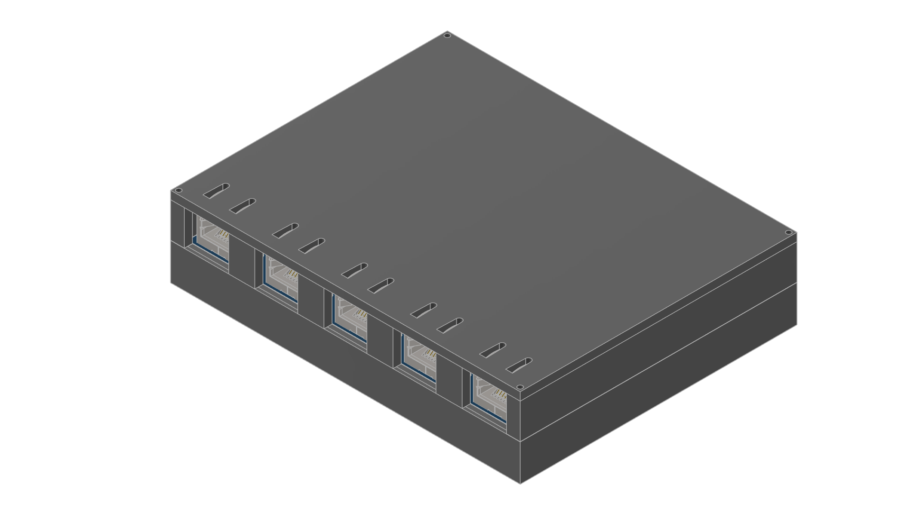
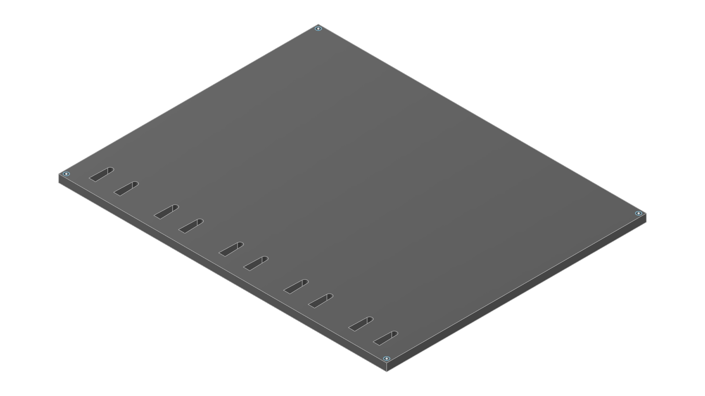
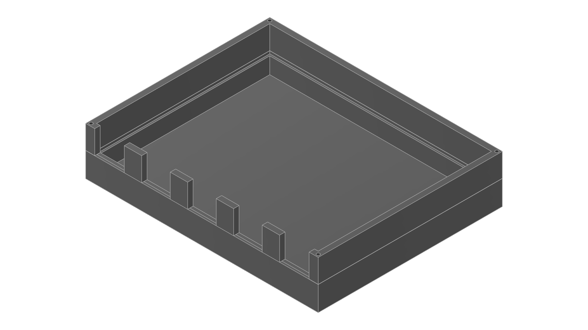

# 3D case

3D case is designed to be 3D printed from easy to print materials like PLA or PETG.

## Screws

3D case takes standard M2x12 Screws. Holes are made without countersink and are 13 mm deep for extra safety room and 1.8 mm wide for screw to thread itself into the plastic. If you plan on using metal case with this project, you need to adjust screw hole size.

## Images

3D case + PCB

Top plate

Bottom case

