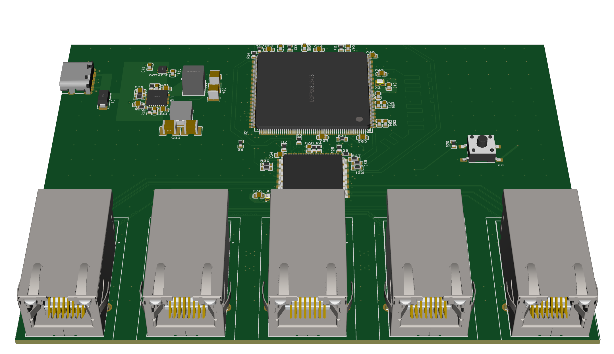
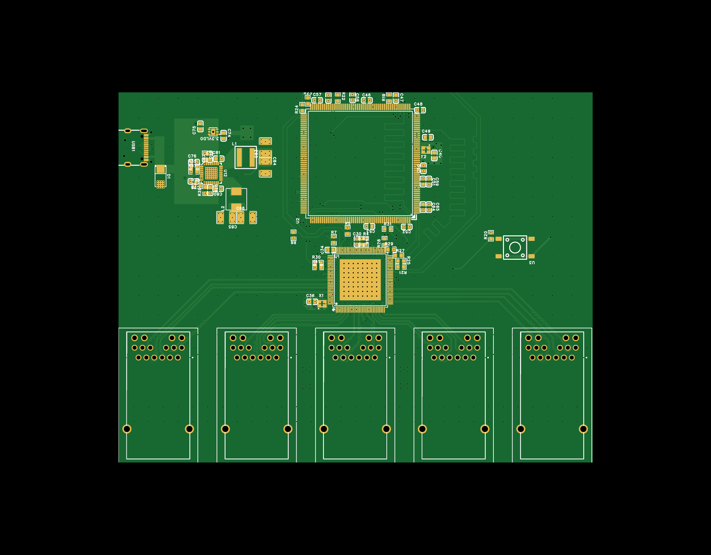
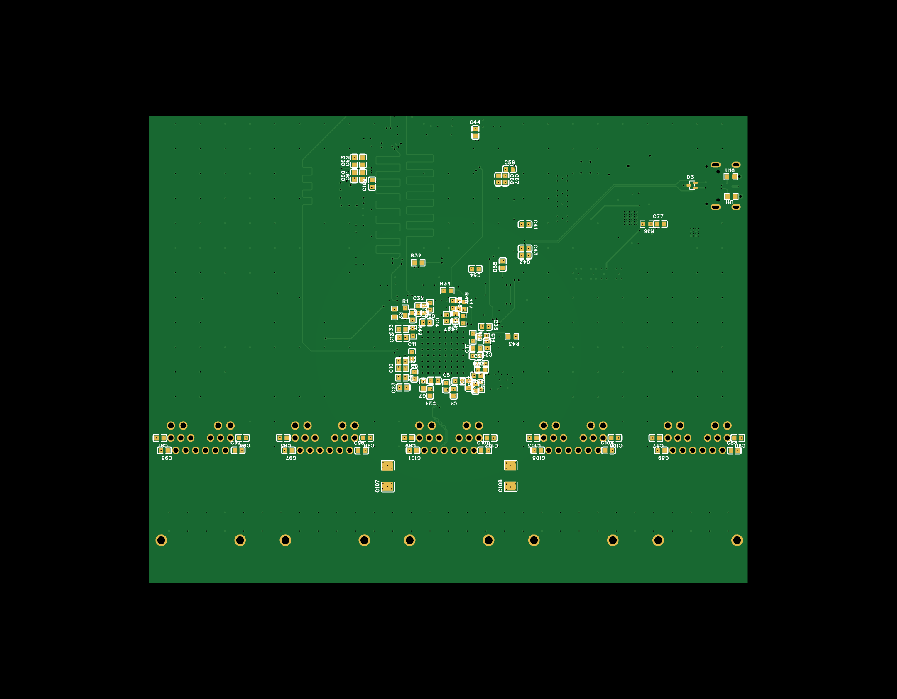

# spark-switch

# Navigation
- [About project](#about-project-what-is-it)
  - [Motivation for the project](#motivation-for-the-project-why-i-made-it)
  - [Learning outcomes](#learning-outcomes-what-i-learned)
  - [Design decisions](#design-decisions)
  - [Directory overview](#directory-overview)
  - [Parts used](#parts-used)
  - [Developement tools](#developement-tools-tools-used)
  - [Features](#features)
  - [Block diagram](#block-diagram)
- [Documentation](#documentation)
- [Blog post](#blog-post)
- [Project status](#project-status)
- [Images](#images)
  - [2D](#2d)
  - [3D](#3d)
  - [Gerber files](#gerber-files)
- [License](#license)
  - [PCB / Schematic](#pcb--schematic-license)
  - [Software](#software-license)
  - [3D files and images](#3d-files-and-images-license)
- [Bill of Materials](#bom)

# About project (What is it)

spark-switch is 6 layer USB-C powered 5 port GbE managed Ethernet switch. It features WebUI interface for configuration and optional MQTT reporting of per-port statistics to Home Assistant (more of the features are listed [here](#features)).

It originated as a hobby project that filled my need for an Ethernet switch as well as taught me high-speed interface routing, and evolved into this fully open source Ethernet switch that is replicable by anyone and fully documented, designed for transparency.

## Motivation for the project (Why I made it)

I made this project because I love tinkering and wanted to use my need for an Ethernet switch as a way to teach myself differential pair routing. And I learned a lot from this. More information about what I learned is listed under [Learning outcomes](#learning-outcomes-what-i-learned) and information about challenges is included in [blog post](#blog-post).

## Learning outcomes (What I learned)

I learned:
- How to properly route differential pairs
- How to properly length tune traces
- How to create more readable schematics
- How to properly manage the GND plane 
- How to work with high speed interfaces

## Design decisions

- 100 Ohm differential controlled impedance for Ethernet traces
- 50 Ohm single ended controlled impedance for RMII and SPI
- Solid GND planes as reference
- 2 power planes, one split one solid
- FR4, 1.6mm thickness
- Via-In-Pad using JLCPCB's free Plated-Over Filled Via technology

## Directory overview

- Firmware project is available in `/Firmware`
- 3D case files as well as Fusion360 project files are available in `/3D`
- EasyEda Pro project files are available in `/PCB`
- Images are available in `/Images`
- Schematic PDF is available in `/Schematic`
- BOM is available in `/BOM.csv` and at the end of README
- Gerber files are available in `/Gerbers`
- Documentation is available in `/Docs`

## Parts used

- STM32F469BET6 as management microcontroller
- KSZ9477STXI as switch IC
- Bel Fuse 0826-1G1T-23-F as RJ45 ports
- ADP2116AACPZ-R7 as 2.5V and 1.2V Buck voltage converter
- TLV76733DRVR as 3.3V LDO voltage converter

## Developement tools (Tools used)

- EasyEda Pro for EDA work
- Fusion360 Educational for 3D work
- STM32CubeMX, STM32CubeIDE and CLion for firmware

## Features

- Management via WebUI
- Port parameter reporting to Home Assistant via MQTT
- 5 port Ethernet switching
- GbE speeds
- Powered by USB-C (5V 3A max)
- Open-Source
- RJ45 ports with integrated magnetics

## Block diagram

### MCU <-> switch IC communication

Communication happens through 2 different interfaces, each with their own purpose. SPI ensures proper management of switch IC, while RMII provides connectivity required for WebUI and MQTT reporting features.

### Power

spark-switch is powered through standard USB-C 5V 2-3A connection. This decision was made to ensure easy usage of device due to its standardization across the world and availability.

Initial 5V from USB-C port is converted to 3.3V by LDO, used for MCU overall power needs and switch IC's digital interfaces, 2.5V for switch IC's core logic, and 1.2V for switch IC's PHY and analog interfaces.

# Documentation

See [docs](Docs/README.md).

# Blog post

See [this link](link-here) *Coming soon!*

# Project status

- PCB: Designed (Not tested)
- Firmware: Prototype version (Not tested)
- Docs: In work
- 3D case: Designed (Not tested)
- Blog post: Coming soon

# Images

## 2D

Click to expand 2D view images

Top view

Bottom view

## 3D

Click to expand 3D view images

EasyEda Pro 3D viewer

3D case + PCB

Top plate

Bottom case

## Gerber files

Click to expand Gerber images

Top layer view

Bottom layer view

Layer 1 / Top layer / Signal

Layer 2 / Inner 1 / Solid GND plane

Layer 3 / Inner 2 / 2.5 and 3.3V split power plane

Layer 4 / Inner 3 / Solid 1.2V power plane

Layer 5 / Inner 4 / Solid GND plane

Layer 6 / Bottom layer / Signal

# License

## PCB / Schematic License

All files in `/PCB`, `/Schematic` and `/Gerbers` folders and their subsequent subfolders are licensed under the CERN Open Hardware License v2 (Weakly Reciprocal).

See `/Licenses/CERN-OHL.txt` for full terms.

## Software License

All files in `/Firmware` folder and their subsequent subfolders are licensed under the Apache 2.0 License.

See `/Licenses/Apache-2.0.txt` for full terms.

## 3D files, images and documentation License

All files in `/3D` `/Images` and `/Docs` folders and their subsequent subfolders are licensed under the CC-BY 4.0 License.

See `/Licenses/CC-BY-4.0.txt` for full terms

# BOM

|Mouser No           |Mfr. No             |Manufacturer       |Description                                                                                                                   |Order Qty.|Price (USD)|Ext.: (USD)            |Link                                                                                                   |
|--------------------|--------------------|-------------------|------------------------------------------------------------------------------------------------------------------------------|----------|-----------|-----------------------|-------------------------------------------------------------------------------------------------------|
|504-HCM1A0503V22R2R |HCM1A0503V2-2R2-R   |Eaton              |Power Inductors - SMD IND MP 2.2uH 6.4A molded 2 PADS SMT                                                                     |1         |$0.93      |$0.93                  |https://eu.mouser.com/ProductDetail/Eaton-Electronics/HCM1A0503V2-2R2-R?qs=XeJtXLiO41RWBA51gkEp5A%3D%3D|
|704-HCM0503-3R3-R   |HCM0503-3R3-R       |Eaton              |Power Inductors - SMD 3.3uH 6.0A                                                                                              |1         |$0.77      |$0.77                  |https://eu.mouser.com/ProductDetail/Eaton-Electronics/HCM0503-3R3-R?qs=9HiBGwelwjteGcQzzVO1cw%3D%3D    |
|708-RNAN0603BKE4K70 |RNAN0603BKE4K70     |SEI Stackpole      |Thin Film Resistors - SMD 4.7KOhms 0603 25ppm Tol 0.1% High Power Alum Nitride                                                |1         |$0.98      |$0.98                  |https://eu.mouser.com/ProductDetail/SEI-Stackpole/RNAN0603BKE4K70?qs=bpu3f%2FCR1jzwNjUVb54Ifw%3D%3D    |
|755-ESR03EZPD4701   |ESR03EZPD4701       |ROHM Semiconductor |Thick Film Resistors - SMD 0603 4.7Kohm 0.50% Anti Surge AEC-Q200                                                             |1         |$0.30      |$0.30                  |https://eu.mouser.com/ProductDetail/ROHM-Semiconductor/ESR03EZPD4701?qs=RLRnP5jfOJWNVmDLWgV9hw%3D%3D   |
|652-CR0603FX-6041ELF|CR0603-FX-6041ELF   |Bourns             |Thick Film Resistors - SMD 6.04K ohm 1%                                                                                       |1         |$0.10      |$0.10                  |https://eu.mouser.com/ProductDetail/Bourns/CR0603-FX-6041ELF?qs=0nF2VnfAjXnJh2M%2FP%252B4L9Q%3D%3D     |
|652-CR0603FX-8201ELF|CR0603-FX-8201ELF   |Bourns             |Thick Film Resistors - SMD 8.2K ohm 1%                                                                                        |1         |$0.10      |$0.10                  |https://eu.mouser.com/ProductDetail/Bourns/CR0603-FX-8201ELF?qs=Ody%252BWaR0NcHnKPXjxZbgSQ%3D%3D       |
|667-ERJ-PA3D2702V   |ERJ-PA3D2702V       |Panasonic          |Thick Film Resistors - SMD 0603 27Kohm 0.5% Anti-Surge AEC-Q200                                                               |1         |$0.24      |$0.24                  |https://eu.mouser.com/ProductDetail/Panasonic/ERJ-PA3D2702V?qs=BzJM0faLVqVhszn7sjlJ5A%3D%3D            |
|594-MCT06030C1009FP5|MCT06030C1009FP500  |Vishay             |Thin Film Resistors - SMD .1W 10ohms 1% 0603 50ppm Auto                                                                       |1         |$0.10      |$0.10                  |https://eu.mouser.com/ProductDetail/Vishay/MCT06030C1009FP500?qs=4DXlcry4fcXzntE6aB0o9Q%3D%3D          |
|71-CRCW0603-191     |CRCW0603191RFKTA    |Vishay             |Thick Film Resistors - SMD 1/10watt 191ohms 1%                                                                                |1         |$0.16      |$0.16                  |https://eu.mouser.com/ProductDetail/Vishay/CRCW0603191RFKTA?qs=be4vbG3eqMQfmmy1Xt7ldg%3D%3D            |
|279-RN73C1J1K0BTDF  |RN73C1J1K0BTDF      |TE Connectivity    |Thin Film Resistors - SMD RN 0603 1K0 0.1% 1 0PPM                                                                             |2         |$0.68      |$1.36                  |https://eu.mouser.com/ProductDetail/TE-Connectivity/RN73C1J1K0BTDF?qs=HLeXuo0aL2rjI2NxXJrhbQ%3D%3D     |
|652-CR0603FX-5101ELF|CR0603-FX-5101ELF   |Bourns             |Thick Film Resistors - SMD 5.1K ohm 1%                                                                                        |2         |$0.10      |$0.20                  |https://eu.mouser.com/ProductDetail/Bourns/CR0603-FX-5101ELF?qs=0nF2VnfAjXkzZl7D0jRjmQ%3D%3D           |
|667-ERA-3AED303V    |ERA-3AED303V        |Panasonic          |Thin Film Resistors - SMD 0603 30Kohms 25ppm 0.5% AEC-Q200                                                                    |2         |$0.17      |$0.34                  |https://eu.mouser.com/ProductDetail/Panasonic/ERA-3AED303V?qs=yocZuyCaXdMHimFdtSiPeQ%3D%3D             |
|667-ERJ-3RED33R0V   |ERJ-3RED33R0V       |Panasonic          |Thick Film Resistors - SMD 0603 Resistor 0.5% 100ppm 33Ohm                                                                    |10        |$0.142     |$1.42                  |https://eu.mouser.com/ProductDetail/Panasonic/ERJ-3RED33R0V?qs=KTDjhDDUMAmaGsZIgaf5Cg%3D%3D            |
|603-AC0603FRE0710KL |AC0603FRE0710KL     |YAGEO              |Thick Film Resistors - SMD 10 kOhms 100 mW 0603  1% AEC-Q200 Standard Power Version                                           |16        |$0.02      |$0.32                  |https://eu.mouser.com/ProductDetail/YAGEO/AC0603FRE0710KL?qs=xZ%2FP%252Ba9zWqYHurLrMYPPHg%3D%3D        |
|584-ADP2116ACPZ-R7  |ADP2116ACPZ-R7      |Analog Devices Inc.|Switching Voltage Regulators Dual-Step Down Converter w/ 3A x 2output                                                         |1         |$10.36     |$10.36                 |https://eu.mouser.com/ProductDetail/Analog-Devices-Inc/ADP2116ACPZ-R7?qs=WIvQP4zGanjhBnvaqIEPmA%3D%3D  |
|579-KSZ9477STXI-TR  |KSZ9477STXI-TR      |Microchip          |Ethernet ICs 7-Port Gigabit Ethernet Switch with Fault Recovery, 1588 v2, AVB, EEE, WOL, QoS, LinkMD+, SGMII, Industrial temp.|1         |$20.91     |$20.91                 |https://eu.mouser.com/ProductDetail/Microchip/KSZ9477STXI-TR?qs=5aG0NVq1C4xvKDJXPEDvJg%3D%3D           |
|947-RCLAMP0502BATCT |RCLAMP0502BATCT     |Semtech            |ESD Protection Diodes / TVS Diodes Low Capacitance ESD & CDE Protection                                                       |1         |$0.97      |$0.97                  |https://eu.mouser.com/ProductDetail/Semtech/RCLAMP0502BATCT?qs=rBWM4%252BvDhIc%2FZh6P%252BVApRQ%3D%3D  |
|576-SMA6L5.0A       |SMA6L5.0A           |Littelfuse         |ESD Protection Diodes / TVS Diodes 600W 5V 5% Uni-Directional                                                                 |1         |$0.44      |$0.44                  |https://eu.mouser.com/ProductDetail/Littelfuse/SMA6L5.0A?qs=VIHlH02q6bVPZcHxXVWyBA%3D%3D               |
|511-STM32F469BET6   |STM32F469BET6       |STMicroelectronics |ARM Microcontrollers - MCU High-performance advanced line, Arm Cortex-M4 core DSP & FPU, 512 Kbytes of Flas                   |1         |$8.50      |$8.50                  |https://eu.mouser.com/ProductDetail/STMicroelectronics/STM32F469BET6?qs=dTJS0cRn7ohWTNcv3ssTNw%3D%3D   |
|595-TLV76733DRVR    |TLV76733DRVR        |Texas Instruments  |LDO Voltage Regulators Adjustable- and fixe d-output 1-A 16-V A A 595-TLV76733DRVT                                            |1         |$0.94      |$0.94                  |https://eu.mouser.com/ProductDetail/Texas-Instruments/TLV76733DRVR?qs=9r4v7xj2LnmGIkwTuPlHig%3D%3D     |
|963-MLASJ168BB7475KT|MLASJ168BB7475KTNA01|TAIYO YUDEN        |Multilayer Ceramic Capacitors MLCC - SMD/SMT 6.3V 4.7uF X7R 0603 10% Medical                                                  |1         |$0.37      |$0.37                  |https://eu.mouser.com/ProductDetail/TAIYO-YUDEN/MLASJ168BB7475KTNA01?qs=tlsG%2FOw5FFjahgohsmNLbA%3D%3D |
|603-CC0603KPX5R6B475|CC0603KPX5R6BB475   |YAGEO              |Multilayer Ceramic Capacitors MLCC - SMD/SMT 10V 4.7uF X5R 0603 10% HI CV                                                     |1         |$0.211     |$0.21                  |https://eu.mouser.com/ProductDetail/YAGEO/CC0603KPX5R6BB475?qs=mzRxyRlhVdtG7wG2BIZZbA%3D%3D            |
|963-MLASE168AB5475KT|MLASE168AB5475KTNA01|TAIYO YUDEN        |Multilayer Ceramic Capacitors MLCC - SMD/SMT 16V 4.7uF X5R 0603 10% Medical                                                   |1         |$0.33      |$0.33                  |https://eu.mouser.com/ProductDetail/TAIYO-YUDEN/MLASE168AB5475KTNA01?qs=tlsG%2FOw5FFihcKM5Bww3QA%3D%3D |
|963-BASJ168AB5106KT |MBASJ168AB5106KTNA01|TAIYO YUDEN        |Multilayer Ceramic Capacitors MLCC - SMD/SMT 6.3V 10uF X5R 0603 10% Industrial                                                |1         |$0.17      |$0.17                  |https://eu.mouser.com/ProductDetail/TAIYO-YUDEN/MBASJ168AB5106KTNA01?qs=tlsG%2FOw5FFip7wSSy5q9Rw%3D%3D |
|963-MLASL168BB5106MT|MLASL168BB5106MTNB33|TAIYO YUDEN        |Multilayer Ceramic Capacitors MLCC - SMD/SMT 10V 10uF X5R 0603 20%                                                            |1         |$0.17      |$0.17                  |https://eu.mouser.com/ProductDetail/TAIYO-YUDEN/MLASL168BB5106MTNB33?qs=tlsG%2FOw5FFiv4vsvq7EGpg%3D%3D |
|963-MAASE32MSB7226MP|MAASE32MSB7226MPNA01|TAIYO YUDEN        |Multilayer Ceramic Capacitors MLCC - SMD/SMT 1210 16V X7R 22uF 20% AEC-Q200                                                   |1         |$0.661     |$0.66                  |https://eu.mouser.com/ProductDetail/TAIYO-YUDEN/MAASE32MSB7226MPNA01?qs=FmjOKN4Os86zaasSFxugIA%3D%3D   |
|581-12101C104M      |12101C104MAT2A      |KYOCERA AVX        |Multilayer Ceramic Capacitors MLCC - SMD/SMT KGM32RR72A104MU NEW GLOBAL PN 100V 0.1uF A 581-KGM32RR72A104MU                   |1         |$0.22      |$0.22                  |https://eu.mouser.com/ProductDetail/KYOCERA-AVX/12101C104MAT2A?qs=FWPE8OmxvdQRu%2FvuFEOTRw%3D%3D       |
|81-GR442QR73D102KW01|GR442QR73D102KW01L  |Murata             |Multilayer Ceramic Capacitors MLCC - SMD/SMT 1000 pF 2 kVDC 10% 1808 X7R                                                      |2         |$0.59      |$1.18                  |https://eu.mouser.com/ProductDetail/Murata/GR442QR73D102KW01L?qs=1XGAtBqYNz74JcxvF1DQuw%3D%3D          |
|581-KGM15BR50J225KT |KGM15BR50J225KT     |KYOCERA AVX        |Multilayer Ceramic Capacitors MLCC - SMD/SMT 6.3V 2.2uF X5R 0603 10%                                                          |2         |$0.17      |$0.34                  |https://eu.mouser.com/ProductDetail/KYOCERA-AVX/KGM15BR50J225KT?qs=Jm2GQyTW%2FbgTJAmtR1rY5w%3D%3D      |
|963-MAASL32MSB7476MP|MAASL32MSB7476MPNA01|TAIYO YUDEN        |Multilayer Ceramic Capacitors MLCC - SMD/SMT 1210 10V X7R 47uF 20% AEC-Q200                                                   |1         |$0.83      |$0.83                  |https://eu.mouser.com/ProductDetail/TAIYO-YUDEN/MAASL32MSB7476MPNA01?qs=FmjOKN4Os87n4oCsWJehZg%3D%3D   |
|581-06035C821JAZ2A  |06035C821JAZ2A      |KYOCERA AVX        |Multilayer Ceramic Capacitors MLCC - SMD/SMT 50V 820pF X7R 0603 5 % Tol FLEX                                                  |2         |$0.34      |$0.68                  |https://eu.mouser.com/ProductDetail/KYOCERA-AVX/06035C821JAZ2A?qs=zKGwLYtK3Ltn1p%252BM3OK9xQ%3D%3D     |
|81-GRM188C81A226ME1D|GRM188C81A226ME01D  |Murata             |Multilayer Ceramic Capacitors MLCC - SMD/SMT 0603 10VDC 22uF 20% X6S                                                          |3         |$0.40      |$1.20                  |https://eu.mouser.com/ProductDetail/Murata/GRM188C81A226ME01D?qs=doiCPypUmgGpyx8gzUcykQ%3D%3D          |
|581-06035A103JAT2A  |06035A103JAT2A      |KYOCERA AVX        |Multilayer Ceramic Capacitors MLCC - SMD/SMT .01UF 50V 5% 0603                                                                |4         |$0.33      |$1.32                  |https://eu.mouser.com/ProductDetail/KYOCERA-AVX/06035A103JAT2A?qs=Cw3yY7soYCOJ7MBOLgA8ng%3D%3D         |
|581-KGM15BS60J105KT |KGM15BS60J105KT     |KYOCERA AVX        |Multilayer Ceramic Capacitors MLCC - SMD/SMT 6.3V 1uF X6S 0603 10%                                                            |6         |$0.12      |$0.72                  |https://eu.mouser.com/ProductDetail/KYOCERA-AVX/KGM15BS60J105KT?qs=PBDs2xEllI9EnrKjYPal4Q%3D%3D        |
|603-CC603JRX7R9BB104|CC0603JRX7R9BB104   |YAGEO              |Multilayer Ceramic Capacitors MLCC - SMD/SMT 50 V 0.1uF X7R 0603 5%                                                           |73        |$0.035     |$2.56                  |https://eu.mouser.com/ProductDetail/YAGEO/CC0603JRX7R9BB104?qs=57cj7OiSijmjSM%252BQadQODQ%3D%3D        |
|520-2016MV-250-BNT  |ECS-2016MV-250-BN-TR|ECS                |Standard Clock Oscillators 25MHz CMOS 1.6-3.6V                                                                                |2         |$1.63      |$3.26                  |https://eu.mouser.com/ProductDetail/ECS/ECS-2016MV-250-BN-TR?qs=MLItCLRbWszJuavuZB87ww%3D%3D           |
|530-0826-1G1T-23-F  |0826-1G1T-23-F      |Bel                |Modular Connectors / Ethernet Connectors RJ45 Connector                                                                       |5         |$7.35      |$36.75                 |https://eu.mouser.com/ProductDetail/Bel/0826-1G1T-23-F?qs=SRYZG9HaIQ0yqJ%252BCqOsSRg%3D%3D             |
|N/A                 |N/A                 |JLCPCB             |PCB                                                                                                                           |5         |$84.99     |$84.99 + $7.90 shipping|https://jlcpcb.com                                                                                     |
|                    |                    |                   |                                                                                                                              |          |Total      |$193.30                |                                                                                                       |

© 2026 emb3rcia

Firmware: Apache 2.0
Hardware: CERN OHL v2
3D & Images: CC BY 4.0
